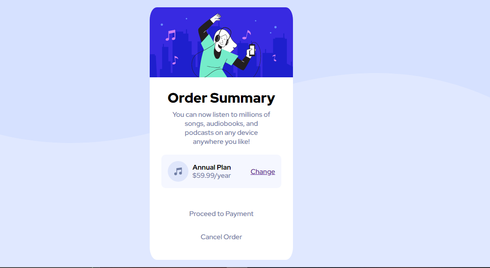

# Frontend Mentor - Order summary card solution

This is a solution to the [Order summary card challenge on Frontend Mentor](https://www.frontendmentor.io/challenges/order-summary-component-QlPmajDUj). Frontend Mentor challenges help you improve your coding skills by building realistic projects. 

## Table of contents

  - [Overview](#overview)
  - [The challenge](#the-challenge)
  - [Screenshot](#screenshot)
  - [Links](#links)
  - [Built with](#built-with)
  - [Author](#author)

## Overview

### The challenge

Users should be able to:

- See hover states for interactive elements

### Screenshot

### Links

- Solution URL: [https://www.frontendmentor.io/challenges/order-summary-component-QlPmajDUj/hub/css-flexbox-QBRJH1gwqR)
- Live Site URL: [https://blazehashira.github.io/Order-summary-component/)

## My process

### Built with

- Semantic HTML5 markup
- CSS custom properties
- Flexbox
- Responsive Design

- [Styled Components](https://styled-components.com/) - For styles

## Author

- Website - [Nasir Sani](https://blazehashira.github.io/Order-summary-component/)
- Frontend Mentor - [@Blazehashira](https://www.frontendmentor.io/profile/Blazehashira)

